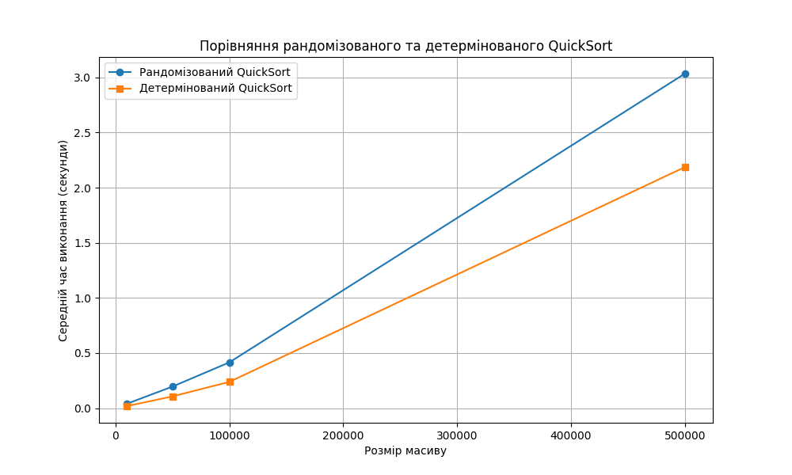

## Порівняння рандомізованого та детермінованого QuickSort

```bash
python quick-sort.py
```

Результат

Розмір масиву: 10000

-   Рандомізований QuickSort: 0.0400 секунд
-   Детермінований QuickSort: 0.0184 секунд

Розмір масиву: 50000

-   Рандомізований QuickSort: 0.1958 секунд
-   Детермінований QuickSort: 0.1067 секунд

Розмір масиву: 100000

-   Рандомізований QuickSort: 0.4154 секунд
-   Детермінований QuickSort: 0.2385 секунд

Розмір масиву: 500000

-   Рандомізований QuickSort: 3.0343 секунд
-   Детермінований QuickSort: 2.1868 секунд

Графік


